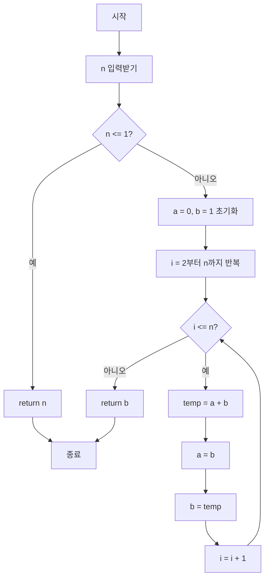

# 반복 방식 피보나치 알고리즘 플로우차트



## 알고리즘 설명

1. **입력 검증**: n이 0 또는 1 이하면 그 값을 그대로 반환
2. **초기화**: a=0, b=1로 시작 (첫 번째와 두 번째 피보나치 수)
3. **반복 계산**:
   - i=2부터 n까지 반복
   - 각 단계에서 새로운 피보나치 수를 계산: temp = a + b
   - a와 b를 업데이트: a = b, b = temp
4. **결과 반환**: 최종적으로 b에 저장된 n번째 피보나치 수 반환

## 시간 복잡도

- **O(n)**: n번의 반복만 필요
- **공간 복잡도 O(1)**: 상수 개의 변수만 사용

## 예시 (n=5)

```
i=2: a=0, b=1 → temp=1 → a=1, b=1
i=3: a=1, b=1 → temp=2 → a=1, b=2
i=4: a=1, b=2 → temp=3 → a=2, b=3
i=5: a=2, b=3 → temp=5 → a=3, b=5
결과: 5
```
